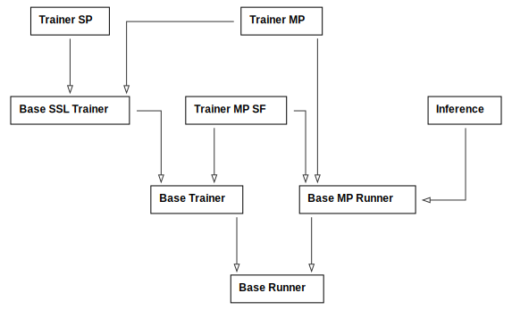

# Solaris

This repository contains the JAX implementation of the Solaris multiplayer world model for Minecraft. It supports GCP TPU training and inference and GPU inference. It also contains the source code for the VLM-as-a-judge multiplayer self-consistency metric.

---

## Inference (GPU)

### Set up Python env

```bash
conda env create -f environment.yml
conda activate solaris

pip install -r requirements_gpu.txt
pip install -e .
```

### Download pretrained model weights

```bash
hf download nyu-visionx/solaris --local-dir ./pretrained
```

See the [nyu-visionx/solaris](https://huggingface.co/nyu-visionx/solaris) HF model repo for all available model weights.

### Download eval datasets

```bash
hf download nyu-visionx/solaris-eval-datasets --local-dir ./datasets
```

See the [nyu-visionx/solaris-eval-datasets](https://huggingface.co/nyu-visionx/datasets/solaris-eval-datasets) for all available evaluation datasets.

### Simple inference

For the simplest scenario, run this:

```bash
python src/inference.py experiment_name=solaris
```

It assumes the datasets are in `./datasets` and uses the pretrained model weights at `./pretrained/solaris.pt`. It will use a batch size of `1` and write generated videos to `./output/`. For inference with a per-device batch size of `1`, the GPU device must have at least `48GB` memory. Refer to the [sharding](#sharding) section for details.

## Evaluation

### VLM metric

The code for the VLM evaluation metric lives under [vlm_eval/](vlm_eval/). Refer to [vlm_eval/README.md](vlm_eval/README.md) for how to run it and the implementation details.

### FID

To get the FID number, check the inference script log file. It outputs FID numbers as log messages by default.

## Training

Only TPU training is supported and requires a device with at least `95GB` of memory (`v5p`) with a per-device batch size of `1`. Refer to the [sharding](#sharding) section for details.

### Set up Python env

```bash
conda env create -f environment.yml
conda activate solaris

pip install -r requirements_tpu.txt
pip install -e .
```

In a multi-host TPU setting, you will need your conda environment on all hosts, which can be achieved by wrapping your installation instruction with `gcloud alpha compute tpus tpu-vm ssh --command {COMMAND}`.

### TPU Storage Setup

There are many ways to store data on GCP TPUs, such as Persistent Disks or GCS buckets. Refer to the [official guide](https://docs.cloud.google.com/tpu/docs/storage-options) for how to set it up. Note that your storage option will need to support writing as well to save training checkpoints and generated outputs.

### Download pretrained model weights

```bash
hf download nyu-visionx/solaris --local-dir YOUR_STORAGE_PATH/pretrained
```

See the [nyu-visionx/solaris](https://huggingface.co/nyu-visionx/solaris) HF model repo for all available model weights.

### Download eval datasets

```bash
hf download nyu-visionx/solaris-eval-datasets --local-dir YOUR_STORAGE_PATH/datasets
```

#### Download training datasets

##### Multiplayer Duet dataset

```bash
hf download nyu-visionx/solaris-training-dataset --local-dir YOUR_STORAGE_PATH/datasets
```

The multiplayer `Duet` dataset is stored in a sharded form on HuggingFace. The above command will download it into `YOUR_STORAGE_PATH/datasets/duet_sharded`. Run the below command to unshard it to the original format that this codebase can work with:

```bash
python unshard_dataset.py --shards YOUR_STORAGE_PATH/datasets/duet_sharded --out YOUR_STORAGE_PATH/datasets/duet
```

##### Single player VPT dataset

The full training pipeline requires training on the single-player [VPT](https://github.com/openai/Video-Pre-Training) dataset. Refer to [vpt_datasets/README.md](vpt_dataset/README.md) for instructions on how to set it up.

### Training stages

The training pipeline consists of four stages, each backed by a dedicated [runner](#runners):

1. Stage 1 — Single-player bidirectional pretraining
2. Stage 2 — Multiplayer bidirectional training
3. Stage 3 — Multiplayer causal training
4. Stage 4 — Multiplayer self-forcing training

Below are the four example commands to run each training stage. Edit the folder paths to where you set them up and run the command as part of `gcloud alpha compute tpus tpu-vm ssh --command {COMMAND}` in a multi-host setting.

### Stage 1 – Single-player bidirectional pretraining

This stage pretrains the initial [Matrix Game 2.0 weights](https://huggingface.co/Skywork/Matrix-Game-2.0/tree/main/base_distilled_model) (available as [matrix-game-init](https://huggingface.co/nyu-visionx/solaris/tree/main/matrix-game-init)) on the VPT dataset, extending the action space.

```bash
python src/train.py \
        runner=trainer_sp \
        model=single_player \
        dataset=vpt \
        +dataset@eval_datasets.vpt=vpt \
        experiment_name=sp_bidirectional_pretrain \
        wandb_entity="YOUR_WANDB_ENTITY" \
        device.batch_size=64 \
        device.eval_batch_size=64 \
        device.data_dir="YOUR_DATASETS_DIR" \
        device.pretrained_model_dir="YOUR_PRETRAINED_MODEL_DIR" \
        device.output_dir="YOUR_OUTPUT_DIR" \
        device.checkpoint_dir="YOUR_CHECKPOINT_DIR" \
        device.jax_cache_dir="YOUR_JAX_CACHE_DIR
```

It will train for 120K steps. The final model weights are the initialization for Stage 2. It will save them to `YOUR_PRETRAINED_MODEL_DIR/sp_bidirectional_pretrain_120000.pt`.

### Stage 2 – Multiplayer bidirectional

This stage trains the multiplayer bidirectional model on the `Duet` datasets obtained from [SolarisEngine](https://github.com/solaris-wm/solaris-engine), starting from the pretrained single player model.

```bash
python src/train.py \
        runner=trainer_mp_bidirectional \
        experiment_name=mp_bidirectional \
        wandb_entity="YOUR_WANDB_ENTITY" \
        device.data_dir="YOUR_DATASETS_DIR" \
        device.pretrained_model_dir="YOUR_PRETRAINED_MODEL_DIR" \
        device.output_dir="YOUR_OUTPUT_DIR" \
        device.checkpoint_dir="YOUR_CHECKPOINT_DIR" \
        device.jax_cache_dir="YOUR_JAX_CACHE_DIR
```

It starts from the model weights at `YOUR_PRETRAINED_MODEL_DIR/sp_bidirectional_pretrain_120000.pt` and trans for 120k steps. Its final model weights are initialization for Stage 3 and the teacher and critic in Stage 4.
It will save them to `YOUR_PRETRAINED_MODEL_DIR/mp_bidirectional_120000.pt`.

### Stage 3 – Multiplayer causal

This stage converts the multiplayer bidirectional model to causal using the Diffusion Forcing objective and a causal attention mask, training on the same `Duet` dataset.

```bash
python src/train.py \
        runner=trainer_mp_causal \
        experiment_name=mp_causal \
        wandb_entity="YOUR_WANDB_ENTITY" \
        device.data_dir="YOUR_DATASETS_DIR" \
        device.pretrained_model_dir="YOUR_PRETRAINED_MODEL_DIR" \
        device.output_dir="YOUR_OUTPUT_DIR" \
        device.checkpoint_dir="YOUR_CHECKPOINT_DIR" \
        device.jax_cache_dir="YOUR_JAX_CACHE_DIR
```

It starts from the model weights at `YOUR_PRETRAINED_MODEL_DIR/mp_bidirectional_120000.pt` and trans for 60k steps. Its final model weights are initialization for the student in Stage 4.
It will save them to `YOUR_PRETRAINED_MODEL_DIR/mp_causal_60000.pt`.

### Stage 4 – Multiplayer self-forcing

This stage finetunes the multiplayer causal model (student) on its own rollouts, distilling from the multiplayer bidirectional model (teacher). This stage removes the test time distribution mismatch and makes the final multiplayer causal model a few-step diffusion model.

```bash
python src/train.py \
        runner=trainer_mp_sf \
        experiment_name=mp_sf \
        wandb_entity="YOUR_WANDB_ENTITY" \
        device.data_dir="YOUR_DATASETS_DIR" \
        device.pretrained_model_dir="YOUR_PRETRAINED_MODEL_DIR" \
        device.output_dir="YOUR_OUTPUT_DIR" \
        device.checkpoint_dir="YOUR_CHECKPOINT_DIR" \
        device.jax_cache_dir="YOUR_JAX_CACHE_DIR" \
        save_model_state_to="YOUR_PRETRAINED_MODEL_DIR/solaris.pt"
```

It initializes the student from `YOUR_PRETRAINED_MODEL_DIR/mp_causal_60000.pt`, and the teacher and critic from `YOUR_PRETRAINED_MODEL_DIR/mp_bidirectional_120000.pt`, and trains for 1.2K steps. It will save the final model weights to `YOUR_PRETRAINED_MODEL_DIR/solaris.pt` which can be used for inference and evaluation.

### TPU inference

TPU Inference requires the same setup as TPU training, except that it doesn't need the [training datasets](#download-training-datasets) part.

Edit the folder paths to where you've set them up and run the below command as part of `gcloud alpha compute tpus tpu-vm ssh --command {COMMAND}` in a multi-host TPU setting:

```bash
python src/inference.py \
        device=tpu \
        experiment_name=solaris \
        device.data_dir="YOUR_DATASETS_DIR" \
        device.pretrained_model_dir="YOUR_PRETRAINED_MODEL_DIR" \
        device.output_dir="YOUR_OUTPUT_DIR" \
        device.checkpoint_dir="YOUR_CHECKPOINT_DIR" \
        device.jax_cache_dir="YOUR_JAX_CACHE_DIR"
```

It will use `YOUR_PRETRAINED_MODEL_DIR/solaris.pt` model weights for inference.

## Code dive-in

### Configuration

This project uses Hydra for configuration. The configs live in [config/](config/). They customize runners, model architectures, and datasets.

### Runners

All training stages and inference code are built around runners. They use inheritance to ensure abstraction and code sharing.

| Runner                                              | Description                                                                                                   |
| --------------------------------------------------- | ------------------------------------------------------------------------------------------------------------- |
| [Base Runner](src/runners/base_runner.py)           | Abstract base for all runners. Handles common evaluation and utility logic.                                   |
| [Base Trainer](src/runners/base_trainer.py)         | Base trainer for all training stages. Add a training loop, checkpointing, and logging on top of `BaseRunner`. |
| [Base MP Runner](src/runners/base_mp_runner.py)     | Base multiplayer runner with evaluation and utilities (batching, rollouts, FID computation).                  |
| [Base SSL Trainer](src/runners/base_ssl_trainer.py) | Base SSL trainer with utilities used by both SP and MP trainers.                                              |
| [Trainer SP](src/runners/trainer_sp.py)             | Single-player bidirectional training used in Stage 1.                                                         |
| [Trainer MP](src/runners/trainer_mp.py)             | Multiplayer trainer used in Stage 2 and 3.                                                                    |
| [Trainer MP SF](src/runners/trainer_mp_sf.py)       | Multiplayer self-forcing trainer used in Stage 4.                                                             |
| [Inference](src/runners/inference.py)               | Inference-only runner for rollouts and metrics.                                                               |

#### Class diagram

Below is the class inheritance diagram for all runners.



#### Training stages and their runners

Here is a summary of what runners each training stage uses:

1. Stage 1 — Single-player bidirectional pretraining: `Trainer SP`
2. Stage 2 — Multiplayer bidirectional training: `Trainer MP` with `bidirectional=True`
3. Stage 3 — Multiplayer causal training: `Trainer MP` with `bidirectional=False`
4. Stage 4 — Multiplayer self-forcing training: `Trainer MP SF`

---

### Model architectures

The codebase supports three model architectures:

| Model           | Description                                                                                                                                                                              | Config file                                                        | JAX Module file                                                                  |
| --------------- | ---------------------------------------------------------------------------------------------------------------------------------------------------------------------------------------- | ------------------------------------------------------------------ | -------------------------------------------------------------------------------- |
| `Solaris`       | Multiplayer world model using the multiplayer attention multiplayer method                                                                                                               | [config/model/solaris.yaml](config/model/solaris.yaml)             | [src/models/multiplayer/world_model.py](src/models/multiplayer/world_model.py)   |
| `Single Player` | Single-player world model following [Matrix Game 2.0](https://github.com/SkyworkAI/Matrix-Game/tree/main/Matrix-Game-2) architecture, with the keyboard action dimension increased to 23 | [config/model/single_player.yaml](config/model/single_player.yaml) | [src/models/singleplayer/world_model.py](src/models/singleplayer/world_model.py) |
| `Concat`        | Multiplayer model using the channel concatenation multiplayer method                                                                                                                     | [config/model/concat.yaml](config/model/concat.yaml)               | [src/models/multiplayer/world_model.py](src/models/multiplayer/world_model.py)   |

### Datasets

This repository supports two types of datasets: training and evaluation datasets. The former is used for training and test loss calculation, and the latter for inference and metrics calculation.

`vpt` and `duet` are two datasets that are both training and evaluation datasets, where inference for evaluation happens on their test splits. There are `7` evaluation-only datasets: `eval_building`, `eval_consistency_opposite`, `eval_consistency`, `eval_grounding`, `eval_memory`, `eval_movement_rotation`, and `eval_movement_translation`. Every dataset has a corresponding config file in [config/dataset/](config/dataset/), and every dataset that is used for evaluation has a dedicated `eval_ids` file in [src/data/eval_ids/](src/data/eval_ids/). The eval ids file together with `EvalBatchSampler()` defined in [src/data/batch_sampler.py](src/data/batch_sampler.py) ensure that evaluation always happens on the same episode segments regardless of the number of GPU/TPU devices used for inference.

Below is a table summarizing all datasets in the codebase:

| Name                        | Config                                                                                         | Training | Evaluation |
| --------------------------- | ---------------------------------------------------------------------------------------------- | -------- | ---------- |
| `vpt`                       | [config/dataset/vpt.yaml](config/dataset/vpt.yaml)                                             | ✓        | ✓          |
| `duet`                      | [config/dataset/duet.yaml](config/dataset/duet.yaml)                                           | ✓        | ✓          |
| `eval_building`             | [config/dataset/eval_building.yaml](config/dataset/eval_building.yaml)                         |          | ✓          |
| `eval_consistency`          | [config/dataset/eval_consistency.yaml](config/dataset/eval_consistency.yaml)                   |          | ✓          |
| `eval_consistency_opposite` | [config/dataset/eval_consistency_opposite.yaml](config/dataset/eval_consistency_opposite.yaml) |          | ✓          |
| `eval_grounding`            | [config/dataset/eval_grounding.yaml](config/dataset/eval_grounding.yaml)                       |          | ✓          |
| `eval_memory`               | [config/dataset/eval_memory.yaml](config/dataset/eval_memory.yaml)                             |          | ✓          |
| `eval_movement_rotation`    | [config/dataset/eval_movement_rotation.yaml](config/dataset/eval_movement_rotation.yaml)       |          | ✓          |
| `eval_movement_translation` | [config/dataset/eval_movement_translation.yaml](config/dataset/eval_movement_translation.yaml) |          | ✓          |

## Sharding

This codebase doesn't implement FSDP and fully replicates the optimizer/models states across all devices. We found that this setup is sufficient for inference on a `48GB` GPU and for training on a `95GB` TPU (`v5p`) with a per-device batch of `1`. However, with this setup, training OOMs on a `80GB` GPU, thus GPU training is not supported.

## Tests

The codebase is covered with tests that live under `src/tests/`. Refer to [src/tests/README.md](src/tests/README.md) for how to run them and what they cover.
